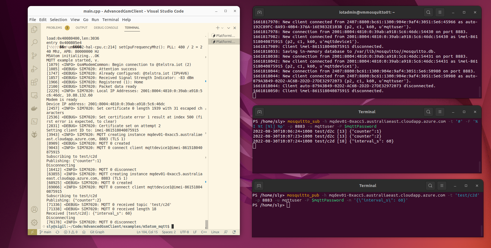

M5Stack Atom example with SIM7020 DTU
=====================================

This example runs on the M5Atom, with the SIM7020 DTU.

The low cost Atom DTU NB-IoT Kit includes the Atom Lite with a SIM7020G module. It has USB-C, an I2C Grove connector, RS485 interface, and a DIN rail mounting. See
https://shop.m5stack.com/products/atom-dtu-nb-iot-kit-global-version-sim7020g

The example shows a secure MQTT connection, with TLS, running on IPv6, over NB-IoT LPWAN. The connection is both encrypted and then authenticated with an MQTT password.

### Pre-requisities

The code can be built and deployed with PlatformIO, running in VS Code.

The example code is configured to connect to a test MQTT server. Scripts to set up your own MQTT test server running in Azure, with IPv6, are available at: https://github.com/sgryphon/iot-demo-build/blob/main/azure-mosquitto/README-mosquitto.md

### Running the example

To run, start the test server, use a terminal to connect a secure shell to the server, and then use `tail` to follow the logs:

```powershell
./start-mosquitto.ps1
ssh iotadmin@mqdev01-0xacc5.australiaeast.cloudapp.azure.com
sudo tail -f /var/log/mosquitto/mosquitto.log
```

In another shell, start a mosquitto client listening on all topics:

```powershell
$mqttPassword = 'YourSecretPassword'
mosquitto_sub -h mqdev01-0xacc5.australiaeast.cloudapp.azure.com -t '#' -F '%I %t [%l] %p' -p 8883 -u mqttuser -P $mqttPassword
```

Then, in the PIO shell, deploy (upload) to your device, and then monitor the serial output:

```shell
export PIO_MQTT_PASSWORD=YourMqttPassword3
(export PIO_VERSION=$(git describe --tags --dirty); pio run --target upload)
pio device monitor --baud 115200
```

To test downstream, use another terminal:

```powershell
$mqttPassword = 'YourSecretPassword'
mosquitto_pub -h mqdev01-0xacc5.australiaeast.cloudapp.azure.com -t 'cmd/demo/1/dev00001/req' -p 8883 -u mqttuser -P $mqttPassword -m '{\"interval_s\":60}'
```

### Led indicators

The code sets the Atom LED to indicate status:

* solid yellow = initialisation
* single green flash = ready
* blue = message sending / receiving
* yellow slow flash (2s) = connected (subscribed, waiting for messages)
* red = fatal error

### Example output



You can see the device IP address (2001:8004...46dc) appear in the Mosquitto logs, along with the client ID (containing the IMEI of the module).

The connection is to port 8883, over TLS, with an MQTT user and password for authentication.

You can see the device to cloud messages (counter 1, 2, etc), as well as a cloud to device message (e.g. set the interval) appear in the device log.
